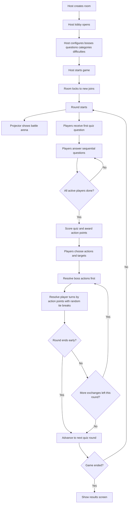

# Implementation Plan: Game Loop

**Branch**: `[feat/004-game-loop]` | **Date**: 2026-03-17 | **Spec**: [spec.md](/home/chris/dev/personal/boss-battle/specs/004-game-loop/spec.md)
**Input**: Feature specification from `/specs/004-game-loop/spec.md`

## Summary

Extend the existing room creation, host lobby, quiz-round, and battle-state
flows into one explicit end-to-end game loop. Reuse the current `/`,
`/host/$joinCode`, and `/join/$joinCode` route shells plus the existing Convex
session, quiz, and battle modules; tighten their phase contracts so the host
can create an isolated room, configure the lobby, lock joining at game start,
run quiz rounds that award action points, resolve automatic boss turns followed
by ordered player turns, handle disconnect/rejoin rules, and finish on an
explicit results screen.

## Technical Context

**Language/Version**: TypeScript 5.7, React 19, Convex functions in TypeScript  
**Primary Dependencies**: TanStack Start 1.132, TanStack Router, TanStack Query, Convex 1.27, `@convex-dev/react-query`, Tailwind CSS v4, Cloudflare/Wrangler  
**Storage**: Convex tables for sessions, player entries, quiz rounds, assignments, answers, battle encounters, combatant states, boss definitions, and skill definitions; browser `localStorage` for per-device join identity  
**Testing**: `pnpm exec tsc --noEmit`, `pnpm lint`, `pnpm test`, focused route/component and Convex tests during implementation, plus a final `pnpm test:e2e` gate because user-facing host/player game-loop flows and Convex-backed browser integration change materially  
**Target Platform**: Cloudflare-hosted web application for a shared projector host screen and modern mobile browsers  
**Project Type**: Full-stack web app  
**Performance Goals**: Hosts can create a room and reach the lobby in under 5 seconds; players see the next quiz question immediately after answering; host/player battle-phase updates propagate within 5 seconds of quiz completion or battle resolution; the host can identify ready-vs-waiting players within 5 seconds from the projector view  
**Constraints**: Preserve the existing route ownership under `/`, `/host/$joinCode`, and `/join/$joinCode`; keep frontend Convex access centralized in `src/integrations/convex/join.ts`; validate route params, join forms, host config payloads, action submissions, and target selections at the trust boundary; do not hand-edit generated TanStack or Convex outputs; keep `pnpm` workflows, Cloudflare compatibility, and Convex realtime patterns intact; extend existing logging helpers for load failures, mutations, and state transitions rather than adding a second observability path  
**Scale/Scope**: 3 user stories; updates to room creation, host lobby, host/projector arena, player join and quiz progression, and battle/results states; changes centered on `src/routes/index.tsx`, `src/routes/host/$joinCode.tsx`, `src/routes/join/$joinCode.tsx`, `src/components/join/`, `src/integrations/convex/join.ts`, `convex/gameSessions.ts`, `convex/quizRounds.ts`, `convex/playerEntries.ts`, `convex/battleState.ts`, `convex/schema.ts`, and related tests

## Constitution Check

*GATE: Must pass before Phase 0 research. Re-check after Phase 1 design.*

- [x] Scope is captured as independently testable user stories with acceptance scenarios and measurable success criteria.
- [x] Runtime boundaries are identified: route params (`joinCode`), room-creation and host-lobby actions, join forms, quiz answer submissions, battle action and target submissions, Convex queries/mutations, browser device identity, and generated Convex client contracts.
- [x] Validation strategy is explicit for every untrusted input and no new unchecked `any` or silent fallback is required.
- [x] Test plan covers the narrowest useful automated tests for every changed behavior and names the verification commands to run.
- [x] Loading, empty, success, and error states are defined for each affected user-facing flow.
- [x] Observability and performance impact are addressed for SSR, streaming, bundle size, or network round trips when applicable.
- [x] Cloudflare, Convex, and `pnpm` workflow compatibility is preserved and no deviation is required.

**Pre-Phase-0 Assessment**: Pass. The clarified spec defines the key lifecycle decisions that most affect architecture and validation: round exchange selection, disconnect handling, rejoin timing, tie-breaking, and automatic boss actions. Research can therefore focus on best-fit repo seams and contract design rather than open product questions.

**Post-Phase-1 Assessment**: Pass. The design keeps room, quiz, and battle state authoritative in Convex; extends the existing host/player route and query seams instead of adding parallel entry points; defines explicit loading, blocked, waiting, active, results, and error states; and keeps verification centered on deterministic `pnpm` commands with required AppHost coverage for browser-visible flow changes.

## Project Structure

### Documentation (this feature)

```text
specs/004-game-loop/
├── plan.md
├── research.md
├── data-model.md
├── quickstart.md
├── contracts/
│   ├── convex-game-loop-contract.md
│   └── route-game-loop-contract.md
└── tasks.md
```

### Source Code (repository root)

```text
src/
├── components/
│   ├── join/
│   └── ui/
│       └── 8bit/
├── integrations/
│   ├── convex/
│   └── tanstack-query/
├── routes/
│   ├── host/
│   └── join/
└── test/

convex/
├── battleState.ts
├── gameSessions.ts
├── playerEntries.ts
├── quizAssignments.ts
├── quizRounds.ts
├── schema.ts
└── lib/

devops/
└── tests/
```

**Structure Decision**: Keep room creation in `src/routes/index.tsx`, keep
host/projector gameplay orchestration in `src/routes/host/$joinCode.tsx`, keep
player lifecycle branching in `src/routes/join/$joinCode.tsx`, extend the
shared hook and logging seam in `src/integrations/convex/join.ts`, and deepen
the existing Convex domain modules in `convex/` rather than introducing new
top-level services or route trees. Use `src/components/join/` for feature UI
composition and keep retro presentation wrappers in repo-owned UI components.

## Phase 0: Research Summary

- Keep Convex as the authoritative runtime store for room state, quiz progress,
  battle exchanges, disconnect/rejoin eligibility, and final session outcome so
  host, player, and projector views stay synchronized.
- Extend existing summary seams first: `gameSessions.getHostOverview` remains
  the host/projector contract, and `quizRounds.getPlayerQuizState` remains the
  player contract. Avoid adding parallel polling seams unless an extension
  becomes unmanageably phase-heavy.
- Treat `battleState.startEncounter` as the likely foundation for the host’s
  “Start game” transition, but plan for explicit session/game lifecycle fields
  so room locking, round sequencing, and results-state visibility are modeled
  directly instead of inferred loosely from encounter presence alone.
- Expand battle resolution beyond the current aggregate effect model so the
  design can represent automatic boss action choice, explicit target handling,
  descending action-point order, random tie-breaking, and early round/session
  termination.
- Preserve the current join and logging policies: joins are blocked once the
  game is locked, disconnected players leave the active round immediately, and
  existing frontend logging helpers remain the observability seam for failed
  loads, mutations, and encounter transitions.
- Keep terminology explicit in planning: quiz scoring still uses stored token
  balances today, but the feature runtime treats battle spending as `action
  points`; the implementation keeps `awardedTokens` as the scored per-answer
  value and cumulative `tokenBalance` as a leaderboard-facing total, while each
  round converts that round's summed `awardedTokens` into spendable
  `currentActionPoints` for the player's combatant and expires unspent action
  points at round end.
- Use route/component tests plus Convex domain tests as the primary correctness
  net during implementation, and keep `pnpm test:e2e` as the required final
  AppHost/browser gate because the affected flows are user-facing and
  Convex-backed.

## Phase 1: Design Summary

- Add explicit game-loop lifecycle fields to the session/round model so the
  host and player surfaces can distinguish lobby, quiz, waiting, battle-action,
  battle-resolution, round-complete, results, and host-ended states without
  overloading a single status flag.
- Extend the host overview to include room config, join-lock state, per-player
  quiz completion markers, exchange progress, and final results data while
  keeping one route-level summary subscription.
- Extend the player quiz/battle summary to expose the current phase, current
  question or waiting reason, rejoin eligibility, action choices, target
  choices, combat status, and end-of-game result state from the same player
  seam.
- Represent random one-to-three exchanges as round-level data chosen at round
  start, and model each battle exchange as a boss-first then player-ordered
  resolution pass that can stop early on victory, defeat, or no-actions-left.
- Keep disconnect handling and rejoin rules explicit in round participation so
  the active round can finish without blocking while still allowing players to
  return in later rounds if the game remains active.
- Preserve loading, unavailable, blocked, ready, waiting, active, results, and
  error states in the host and player routes, and extend the existing logging
  helpers with enough phase context to identify failed room, round, and battle
  transitions.

## Lifecycle Ownership

### Public mutation ownership

- `gameSessions.create`
  Creates a fresh room and returns host/join paths. No room history browsing is
  exposed from this flow.
- `gameSessions.setJoinStatus`
  Allows pre-start join open/close changes only while the room is still in the
  lobby lifecycle.
- `battleState.startEncounter`
  This is the public `Start Game` mutation. It must:
  - validate the locked host config
  - close joining for the session
  - persist the lobby config snapshot onto the session
  - create the active encounter
  - create round 1 through the shared round-start helper
- `quizAssignments.submitAnswer`
  Remains the public per-question mutation that advances the player through quiz
  batches.
- `battleState.submitPlayerAction`
  Records one player's action and target for the active battle exchange.
- `battleState.resolveBattleExchange`
  New public mutation responsible for one exchange only. It must:
  - choose boss actions and targets automatically
  - compute tied player order randomly among equal action-point totals
  - resolve boss turn first, then player turns
  - update combatant, exchange, and round state
  - decide whether to continue the round, start the next round, or end the game
- `gameSessions.endGame`
  Explicit host action to terminate the active game and move the session to the
  results state.

### Internal orchestration ownership

- `quizRounds.startRound`
  Becomes the shared internal round-start helper used by
  `battleState.startEncounter` for round 1 and by `battleState.resolveBattleExchange`
  when a round ends and the next quiz round should begin.
- `battleState.resolveEncounterRound`
  Existing aggregate round-resolution behavior is superseded by
  `battleState.resolveBattleExchange`; if retained during refactor, it should be
  reduced to an internal helper or removed to avoid two competing battle
  lifecycles.

## Scoring Economy

- `awardedTokens` on each scored quiz answer remains the stored source value for
  answer correctness and difficulty reward compatibility.
- The round-total sum of `awardedTokens` for a player becomes that player's
  spendable `currentActionPoints` for the current round.
- `tokenBalance` remains a cumulative, leaderboard-facing total and is not the
  direct source of spendable action points once the game loop is active.
- Unspent `currentActionPoints` expire at round end; they do not carry into the
  next quiz round.
- `nextQuizAdvantage` remains the only carry-forward player benefit between
  rounds in this feature slice.

## Storage Strategy

- `Lobby Configuration`
  Persist as new locked config fields on `gameSessions` rather than a separate
  table so room start uses one authoritative session record.
- `Round Participation`
  Persist as a new `roundParticipants` table keyed by `roundId` and
  `playerEntryId` so disconnect removal, quiz completion, and later-round
  rejoin rules are explicit and queryable.
- `Battle Exchange`
  Persist as a new `battleExchanges` table keyed by `roundId` and
  `exchangeNumber` so exchange progress, boss actions, and ordered player turns
  are auditable and deterministic.
- `Session Result`
  Persist as completion fields on `gameSessions` and derive the display model
  from `gameSessions` plus `battleEncounters`; do not add a standalone results
  table for this feature.

## Standards Review Plan

- **Coding standards source**: `docs/codingstandards/README.md`,
  `docs/codingstandards/shared.md`, and the stack-specific standards for React,
  TanStack Start, Convex, testing, shadcn, and Aspire when those files are in
  scope.
- **Delegated review step**: If delegated subagents are available and allowed in
  the active runtime, run a dedicated standards-review subagent after each major
  implementation slice and once again before merge. The subagent should review
  the applicable coding standards docs and assess the changed code against those
  standards.
- **Response plan**: Address relevant standards-review findings before moving to
  the next slice. If a finding is intentionally deferred, record the reason and
  owner in the work record.
- **Coding standards edits**: If implementation appears to require changing
  `docs/codingstandards/`, stop and ask the user before making any standards
  edit.

## Screen Wireframes

### Home / Room Creation

```text
+------------------------------------------------------+
| Mega Boss Battle                                     |
| Start a Boss Battle session                          |
|                                                      |
| [ Create Session ]   [ Resume Session ]              |
|                                                      |
| Active room (optional): BATTLE                       |
| No historical room browser is shown here             |
+------------------------------------------------------+
```

### Host Lobby / Pre-Game Setup

```text
+--------------------------------------------------------------+
| Room: BATTLE                Joining: Open/Closed             |
| QR Code                     Join URL                         |
|                                                              |
| Connected Players                                           |
| - Ari                                                       |
| - Nova                                                      |
| - Zed                                                       |
|                                                              |
| Game Config                                                  |
| Bosses: [Boss A] [Boss B]                                   |
| Questions/Round: [ 3 ]                                      |
| Categories: [history] [science]                             |
| Difficulties: [easy] [medium] [hard]                        |
|                                                              |
| [ Start Game ]                                               |
+--------------------------------------------------------------+
```

### Host Projector / Quiz Progress

```text
+--------------------------------------------------------------+
| Round 1                           Exchange Limit: 2          |
| Battle Arena visible                                          |
|                                                              |
| Party Side                     Boss Side                      |
| Ari        [check]            Boss A   HP ███████            |
| Nova       [check]            Boss B   HP █████              |
| Zed        [ ... ]                                            |
|                                                              |
| Status: Waiting for remaining players to finish quiz         |
+--------------------------------------------------------------+
```

### Player Phone / Quiz

```text
+----------------------------------------------+
| Round 1                                      |
| Question 2 of 3                              |
|                                              |
| Which answer is correct?                     |
| ( ) A                                        |
| ( ) B                                        |
| ( ) C                                        |
| ( ) D                                        |
|                                              |
| [ Lock Answer ]                              |
+----------------------------------------------+
```

### Player Phone / Action Selection

```text
+----------------------------------------------+
| Ari                                           |
| HP: 8/10        Action Points: 4             |
|                                              |
| Available Actions                             |
| [ Attack ] [ Heal ] [ Guard ] [ Study ]      |
|                                              |
| Target                                        |
| ( ) Boss A                                   |
| ( ) Boss B                                   |
|                                              |
| [ Confirm Action ]                           |
+----------------------------------------------+
```

### Results Screen

```text
+--------------------------------------------------------------+
| Game Over                                                     |
| Players Win / Bosses Win / Host Ended Game                   |
|                                                              |
| Rounds Completed: 4                                          |
| Remaining Players: 2                                         |
| Remaining Bosses: 0                                          |
|                                                              |
| [ Start New Room ]                                           |
+--------------------------------------------------------------+
```

## Game Loop Flow



## Validation Matrix

| Behavior | Primary layer | Assertions | Commands | Issue response |
|----------|---------------|------------|----------|----------------|
| Fresh room creation with no room history | Route integration test | `/` shows create flow, optional single active-room resume, and no browseable history list | `pnpm test -- --run src/routes/-index.test.tsx` | Fix the route/query contract first; if blocked by unrelated failure, record the blocker before moving on |
| Host lobby config and start-game lock | Host route integration + Convex mutation tests + E2E | host can configure bosses/question rules, start game closes joining, first round is initialized, host/projector shell still loads under AppHost | `pnpm test -- --run src/routes/host/-\$joinCode.test.tsx src/components/join/host-battle-setup.test.tsx convex/battleState.test.ts` then `pnpm test:e2e` | Treat start-game and join-lock failures as stop-the-line issues; fix or explicitly document the blocking defect before advancing to the next slice |
| Sequential quiz progression | Player route integration + quiz round tests + E2E | next question appears automatically, ready markers update, scoring completes only after all active players finish or are removed, browser flow still works end-to-end | `pnpm test -- --run src/routes/join/-\$joinCode.test.tsx convex/quizRounds.test.ts convex/lib/quizRoundSelection.test.ts` then `pnpm test:e2e` | Fix progression regressions before adding later battle work; if E2E exposes an AppHost/browser issue, investigate and either fix it in-slice or log it as a blocking dependency |
| Difficulty-based action-point conversion | Convex integration tests | round-summed `awardedTokens` become spendable `currentActionPoints`, `tokenBalance` remains cumulative, unspent action points expire at round end | `pnpm test -- --run convex/quizRounds.test.ts convex/battleState.test.ts` | Fix economy mismatches immediately because later battle tests depend on these invariants |
| Automatic boss turn plus target-aware player turns | Convex battle integration tests + E2E | boss turn resolves first, target validation applies, player order is descending by action points, browser-visible battle flow still loads | `pnpm test -- --run convex/battleState.test.ts` then `pnpm test:e2e` | Resolve ordering/target issues before layering more UI work; if E2E fails, investigate the host/player route behavior before continuing |
| Random tie-breaking on equal action points | Convex battle integration tests | equal action-point players receive randomized order without host input and order is recorded on the exchange | `pnpm test -- --run convex/battleState.test.ts` | Fix determinism/recording gaps before accepting the exchange model as complete |
| Disconnect removal and later-round rejoin | Convex + player route integration tests + E2E | disconnected player is removed from the current round immediately, cannot re-enter that round, and may return next round if game remains active | `pnpm test -- --run src/routes/join/-\$joinCode.test.tsx convex/quizRounds.test.ts convex/battleState.test.ts` then `pnpm test:e2e` | Treat disconnect/rejoin failures as blocking because they affect state ownership and live-session reliability |
| Results and host-ended termination | Host/player route integration + Convex tests + E2E | victory, defeat, no-actions-left, and host-ended outcomes all land on explicit results state in both route and browser flows | `pnpm test -- --run src/routes/host/-\$joinCode.test.tsx src/routes/join/-\$joinCode.test.tsx convex/battleState.test.ts` then `pnpm test:e2e` | Fix results-state mismatches before closing the feature; do not defer broken termination behavior |
| Typed-boundary and repo-wide gate | Type/lint/full integration/E2E | no contract drift, no lint regressions, browser-visible shell still passes AppHost smoke gate | `pnpm exec tsc --noEmit && pnpm lint && pnpm test && pnpm test:e2e` | If failures are unrelated, document them explicitly; otherwise fix before merge |

## Phase Verification Policy

- Every implementation slice must add or update focused integration coverage at
  the route/component or Convex layer before the slice is considered complete.
- Any slice that changes host/player browser-visible behavior must run
  `pnpm test:e2e` before the slice is considered complete.
- If delegated subagents are available and allowed, every implementation slice
  must run a standards-review subagent against the applicable coding standards
  docs and the newly changed code before the slice is considered complete.
- Validation happens incrementally, not only at the end:
  - after the room/lobby slice
  - after the quiz progression slice
  - after the battle-resolution slice
  - after the results/termination slice
- When a focused integration test or `pnpm test:e2e` fails, the default
  response is to investigate and fix the issue in the same slice.
- When the standards-review subagent reports a standards mismatch, the default
  response is to fix the code to conform. If the mismatch appears to require a
  standards-document change, stop and ask the user before editing
  `docs/codingstandards/`.
- If a failure is proven unrelated and cannot be fixed within the slice, record
  the exact failing command, failure summary, and why it is unrelated before
  moving forward.
- Do not stack additional phases of work on top of a known unresolved failure
  in the same game-loop area.

## Phase 2: Implementation Strategy

1. Extend Convex schema with locked lobby-config fields on `gameSessions`, a new `roundParticipants` table, a new `battleExchanges` table, and the explicit lifecycle fields required for room results and round exchange progress.
2. Refactor mutation ownership so `battleState.startEncounter` is the public start-game entrypoint, `quizRounds.startRound` becomes the shared round-start helper, `battleState.resolveBattleExchange` owns one exchange resolution pass, and `gameSessions.endGame` owns host termination.
3. Normalize the scoring economy so per-answer `awardedTokens` feed both cumulative `tokenBalance` and round-local `currentActionPoints`, with unspent action points expiring at round end.
4. Expand `gameSessions.getHostOverview`, `quizRounds.getPlayerQuizState`, and `src/integrations/convex/join.ts` to expose locked config, participation states, exchange progress, results, and target-aware player actions from the existing query seams.
5. Update `src/routes/index.tsx`, `src/routes/host/$joinCode.tsx`, `src/routes/join/$joinCode.tsx`, and supporting `src/components/join/` components to render the lobby, quiz, waiting, battle, disconnect, rejoin, and results states shown in the wireframes.
6. After slice 1 through 3, run the focused integration tests mapped in the validation matrix and respond to failures immediately before proceeding.
7. After slice 4 and 5, run the relevant route/component integration tests plus `pnpm test:e2e`, then investigate and fix any host/player browser-visible regressions before continuing.
8. Finish with the repo-wide verification gate: `pnpm exec tsc --noEmit`, `pnpm lint`, `pnpm test`, and `pnpm test:e2e`; document any proven unrelated failures explicitly before merge.

## Complexity Tracking

| Violation | Why Needed | Simpler Alternative Rejected Because |
|-----------|------------|-------------------------------------|
| None | N/A | N/A |
