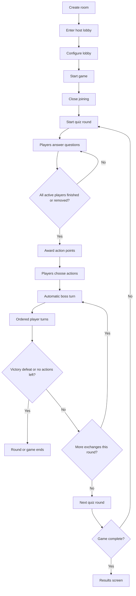

# Research: Game Loop

## Decision 1: Reuse the existing host and player route shells

**Decision**: Keep the full game loop inside the existing `/`, `/host/$joinCode`,
and `/join/$joinCode` routes instead of adding new public route trees.

**Rationale**: The repo already treats those routes as the authoritative host,
player, and room-creation shells. Extending them preserves current ownership,
keeps the route tree simple, and matches the constitution’s preference for
incremental vertical slices rather than parallel scaffolding.

**Alternatives considered**:
- Add separate projector-only or battle-only routes. Rejected because it would
  duplicate state handling and split one live session across more entry points.
- Move room creation into a separate host-only workflow outside `/`. Rejected
  because the current home page already owns session launch and resume behavior.

## Decision 2: Extend current Convex summary seams instead of layering new polls

**Decision**: Keep `gameSessions.getHostOverview` as the host/projector summary
and `quizRounds.getPlayerQuizState` as the player summary, extending each with
explicit game-loop phase data.

**Rationale**: Both routes already branch from those summaries. Expanding them
keeps one subscription per route surface, makes loading and error states easier
to reason about, and follows the established `src/integrations/convex/join.ts`
boundary for hooks and logging.

**Alternatives considered**:
- Add separate game-loop or battle-only queries and merge them in routes.
  Rejected because it increases network fan-out and multiplies state branches.
- Replace the existing summaries outright. Rejected because join and quiz flows
  already depend on them and a replacement would add unnecessary migration risk.

## Decision 3: Keep Convex authoritative for room, round, and battle state

**Decision**: Store room lifecycle, round participation, exchange progress,
combat state, and final result state in Convex rather than deriving them from
client-local route state.

**Rationale**: The feature requires synchronized host, player, and projector
views, reconnect-safe behavior, and deterministic room locking. Those are all
cross-client guarantees that need a single trusted runtime source.

**Alternatives considered**:
- Keep more phase state only in the browser. Rejected because reconnects and
  projector visibility would become fragile and difficult to verify.
- Persist only aggregate room outcome data. Rejected because ordered turns,
  disconnect rules, and readiness markers require finer-grained state.

## Decision 4: Model battle exchanges explicitly at the round level

**Decision**: Represent the randomly chosen one-to-three exchange count as
round-level state chosen at round start, then resolve exchanges as boss-first
then player-ordered passes until the chosen limit or an early-stop condition is
reached.

**Rationale**: The clarified spec makes the exchange count a product decision,
not an implementation detail. Storing it explicitly removes ambiguity from
testing, player messaging, and host progress displays.

**Alternatives considered**:
- Infer exchange count implicitly during resolution. Rejected because tests and
  projector messaging would have to reverse-engineer round progress.
- Keep battle progression as a single aggregate step after quiz completion.
  Rejected because it cannot represent the clarified turn order and tie-breaks.

## Decision 5: Treat disconnects as current-round removal with later-round rejoin

**Decision**: Remove disconnected players from the active round immediately and
allow them to return only in a later round if the game is still active.

**Rationale**: This preserves live-session momentum, avoids indefinite waits,
and fits the host-led nature of the game. It also gives planning a clear
participation rule for round completion and player-state messaging.

**Alternatives considered**:
- Wait for disconnected players. Rejected because the round can stall
  indefinitely.
- Eliminate disconnected players from the rest of the game. Rejected because it
  is unnecessarily punitive for a live audience setting.
- Allow players to re-enter the same round mid-stream. Rejected because it
  rewinds already-resolved quiz and battle state.

## Decision 6: Keep boss decisions automatic, but make them explicit in contracts

**Decision**: The game chooses boss actions and targets automatically during
battle resolution, and that behavior must be visible in the route and Convex
contracts rather than hidden in an opaque helper.

**Rationale**: Automatic boss turns reduce host overhead and keep the shared
screen moving, but the plan still needs explicit contracts so turn ordering,
target selection, and observability can be tested and reasoned about.

**Alternatives considered**:
- Require host-driven boss turns. Rejected because it slows the live flow and
  introduces a second operator interaction path.
- Leave boss choice fully implicit in low-level resolution code. Rejected
  because it obscures test boundaries and failure reporting.

## Decision 7: Validate the feature through route/component tests plus Convex domain tests

**Decision**: Use route/component tests for room, lobby, waiting, results, and
player/host UI branches; use focused Convex tests for round progression,
disconnect handling, ordered battle resolution, and results-state transitions;
and keep `pnpm test:e2e` as the required AppHost gate.

**Rationale**: The most failure-prone logic lives in phase transitions and
domain rules, while the most visible regressions live in host/player route
state branching. This split keeps tests narrow and deterministic without
dropping the browser/AppHost validation required by repo policy.

**Alternatives considered**:
- Lean primarily on E2E coverage. Rejected because it is less precise for
  domain-state regressions and slower for iteration.
- Rely mostly on manual verification. Rejected because the feature adds
  enough stateful behavior that direct automated coverage is warranted.

## Decision 8: Make lifecycle ownership explicit across session, round, and battle mutations

**Decision**: Use `battleState.startEncounter` as the public `Start Game`
mutation, `battleState.resolveBattleExchange` as the public one-exchange
resolver, `gameSessions.endGame` as the public host-end mutation, and reduce
`quizRounds.startRound` to a shared internal round-start helper invoked by game
start and round advancement.

**Rationale**: The previous plan left mutation ownership ambiguous, which would
make tasks and tests drift. The game loop now has one clear owner for each
public lifecycle transition.

**Alternatives considered**:
- Let the host route call `quizRounds.startRound` publicly for every round.
  Rejected because the spec only guarantees a single `Start Game` host action,
  not repeated manual round orchestration.
- Keep `resolveEncounterRound` as the only battle mutation. Rejected because the
  feature requires explicit one-to-three exchange tracking, not only aggregate
  round resolution.

## Decision 9: Separate cumulative quiz totals from round-spendable action points

**Decision**: Keep `awardedTokens` and `tokenBalance` for scored quiz history
and leaderboard totals, but define round-local `currentActionPoints` as the
sum of that round's scored `awardedTokens`, expiring at round end.

**Rationale**: This preserves existing storage compatibility while aligning the
runtime contract with the spec's `action points` terminology and round-based
spending model.

**Alternatives considered**:
- Rename everything to `actionPoints` immediately. Rejected because existing
  quiz and leaderboard seams already use `awardedTokens` and `tokenBalance`.
- Use cumulative `tokenBalance` directly for battle spending. Rejected because
  the clarified flow awards spendable points per round, not as an ever-growing
  account.

## Decision 10: Persist participation and exchange state explicitly

**Decision**: Add a `roundParticipants` table for per-round player lifecycle
state and a `battleExchanges` table for exchange progress, while storing locked
lobby config and completion fields directly on `gameSessions`.

**Rationale**: The feature needs explicit storage for disconnect removal,
next-round rejoin eligibility, exchange ordering, and results-driven session
completion. Keeping these concerns implicit in ad hoc summaries would make the
game loop harder to validate and debug.

**Alternatives considered**:
- Derive round participation entirely from assignments and combatant state.
  Rejected because disconnect removal and later-round eligibility need explicit
  round-scoped ownership.
- Add a standalone results table. Rejected because session completion can be
  expressed directly on `gameSessions` without another top-level read model.

## Wireframe Notes

### Key Screen Shapes

```text
Home
- Create Session
- Resume Session when one active room exists
- No list of older rooms

Host Lobby
- Join code and QR
- Connected roster
- Boss/question/category/difficulty controls
- Start Game action

Host Projector Round State
- Arena remains primary visual
- Player readiness markers visible beside names
- Boss lineup and party state remain visible while waiting

Player Quiz State
- One question at a time
- Immediate advance after each answer
- Clear round/question progress

Player Action State
- Health and action points summary
- Action buttons
- Target selection when required

Results State
- Winner / termination reason
- Room summary
- Clear reset path into a new room
```

### Wireframe Rationale

- The host route already owns both setup and projector behavior, so the
  wireframes keep lobby and arena states in one route shell rather than
  splitting them into separate pages.
- The player route already branches by state, so the wireframes preserve a
  single-screen progression: join -> intro -> quiz -> waiting -> action ->
  results.
- The room-creation wireframe intentionally omits room history because the spec
  requires a fresh-room workflow and prevents browsing past sessions.

## Mermaid Flow


